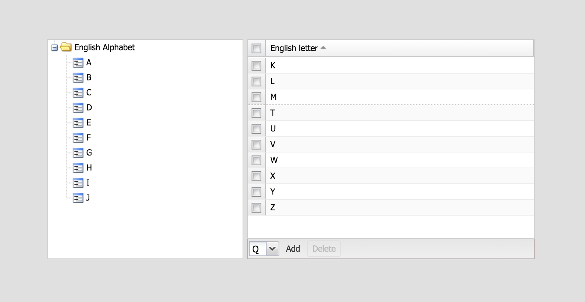
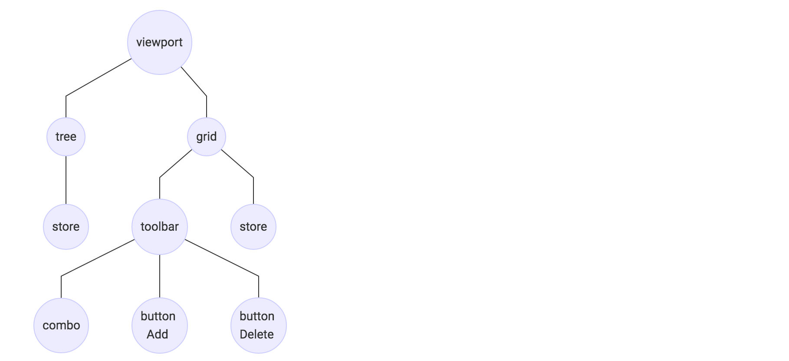
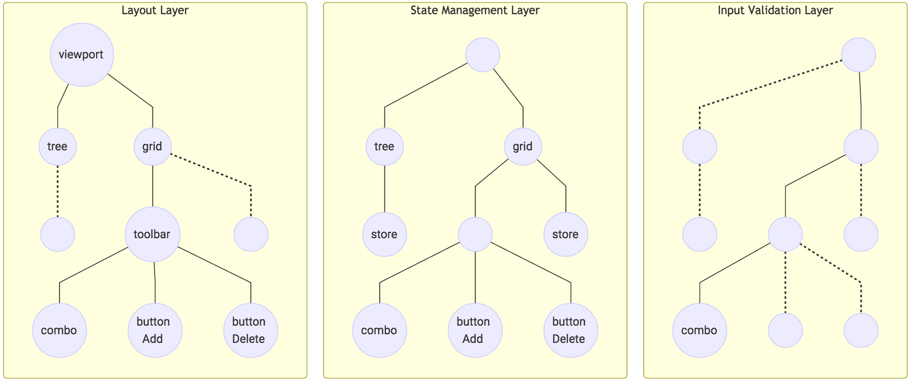

Cascading Component Layers for React
------------------------------------
Design pattern to slice complex component trees.

### Usage

```jsx
import {createLayers, cascadeLayers, createReactElement} from 'cascading-component-layers-react'

function render(){
     const layers = createLayers( React => [
        layout: () =>
            <panel layout="border" height="100" />,
        stateManagement: () =>
            <panel onClick={doSomething()}>
                <store/>
            </panel>,
    ])
    return createReactElement( cascadeLayers( layers, props ))
}
```
Will behave like:
```jsx
function render(){
    return (
        <panel layout="border" height="100" onClick={doSomething()}>
            <store/>
        </panel>
    )
}
```

#### What?

Let suppose that we have some complex component model. For Example:





```html
function render(){
    return (
        <viewport layout="border">
            <tree ref="tree" displayField="letter"
                  region="west" split width="35%" pull-childs
                  on-drop={ this.moveSelected({from: 'grid', to: 'tree'}) } >
                <store proxy="memory" model="LetterModel" pull-childs>
                    <sorters><property-letter /></sorters>
                    <root letter="English Alphabet" expanded leaf="false"/>
                </store>
            </tree>
            <grid ref="grid" selType="checkboxmodel"
                  region="center" pull-childs
                  on-drop={ this.moveSelected({from: 'tree', to: 'grid'}) }>
                <store proxy="memory" model="LetterModel" pull-childs>
                    <sorters><property-letter /></sorters>
                </store>
                <columns>
                    <column dataIndex="letter" flex="1">English letter</column>
                </columns>
                <toolbar dock="bottom">
                    <combo ref="available"
                           displayField="letter" queryMode="local"
                           vtype="alpha" allowBlank="false" maxLength="1" validateOnBlur="false">
                        <store proxy="memory" model="LetterModel" pull-childs>
                            <sorters><property-letter /></sorters>
                        </store>
                    </combo>
                    <button on-click={ this.moveSelected({from: 'available', to: 'grid'}) }
                            bind--disabled="{available.selected.length == 0}">
                        Add
                    </button>
                    <button on-click={ this.moveSelected({from: 'grid', to: 'available'}) }
                            bind--disabled="{grid.selected.length == 0}">
                        Delete
                    </button>
                </toolbar>
            </grid>
        </viewport>
    )
}
```

To refactor it, we can extract sub-nodes into separate components.

```jsx
function render(){
    /** shared sub-component */
    function LettersStore(){
        return (
        <store proxy="memory" model="LetterModel" pull-childs>
            <sorters><property-letter /></sorters>
        </store>
    )}
    return (
        <viewport layout="border">
            <tree ref="tree" store={ LettersStore() } displayField="letter"
                  region="west" split width="35%" pull-childs
                  on-drop={ this.moveSelected({from: 'grid', to: 'tree'}) } >
                <store pull-childs>
                    <root letter="English Alphabet" expanded leaf="false"/>
                </store>
            </tree>
            <grid ref="grid" store={ LettersStore() } selType="checkboxmodel"
                  region="center" pull-childs
                  on-drop={ this.moveSelected({from: 'tree', to: 'grid'}) } >
                <columns>
                    <column dataIndex="letter" flex="1">English letter</column>
                </columns>
                <toolbar dock="bottom">
                    <combo ref="available"
                           store={ LettersStore() } displayField="letter" queryMode="local"
                           vtype="alpha" allowBlank="false" maxLength="1" validateOnBlur="false" />
                    <button on-click={ this.moveSelected({from: 'available', to: 'grid'}) }
                            bind--disabled="{available.selected.length == 0}">
                        Add
                    </button>
                    <button on-click={ this.moveSelected({from: 'grid', to: 'available'}) }
                            bind--disabled="{grid.selected.length == 0}">
                        Delete
                    </button>
                </toolbar>
            </grid>
        </viewport>
    )
}
```

That's OK. But what if we want to group components and props of different nodes in our components tree?
To extract abstractions like layout, state management, input validation. **Different abstractions
can share the same components.** See picture:



To do that kind of splitting, we can extract these abstractions into function-layers and merge it together on render.
Function-layer is the special type of component, that have injected custom `React.createElement` method, which produce
layer elements (pure objects: `{type, props, childs}`), that can be converted to React elements by the `createReactElement`
method.
```jsx
function render(){

    const layers = createLayers( React => [

        function layout(){
            return (
            <viewport layout="border" height="400">
                <tree region="west" split width="35%">
                    <store pull-childs>
                        <root letter="English Alphabet" expanded leaf="false"/></store></tree>
                <grid region="center" selType="checkboxmodel" pull-childs>
                    <columns>
                        <column flex="1">English letter</column></columns>
                    <toolbar    dock="bottom">
                        <combo width="40"/>
                        <button>Add</button>
                        <button>Delete</button> </toolbar></grid></viewport>
        )},
        function stateManagement(){
            return (
            <viewport>
                <tree ref="tree"  store={ LettersStore() }  displayField="letter"
                                on-drop={ this.moveSelected({from: 'grid', to: 'tree'}) } />
                <grid ref="grid"  store={ LettersStore() }
                                on-drop={ this.moveSelected({from: 'tree', to: 'grid'}) } >
                    <combo ref="available" queryMode="local"
                                     store={ LettersStore() } displayField="letter" />
                    <button bind--disabled="{available.selected.length == 0}" disabled
                                  on-click={ this.moveSelected({from: 'available', to: 'grid'}) } />
                    <button bind--disabled="{grid.selected.length == 0}" disabled
                                  on-click={ this.moveSelected({from: 'grid', to: 'available'}) } /></grid></viewport>
        )},
        function inputValidation(){
            return (
            <viewport><grid><combo vtype="alpha" allowBlank="false" maxLength="1" validateOnBlur="false"/></grid></viewport>
        )},
    ])
    /** shared sub-component */
    function LettersStore(){
        return (
        <store proxy="memory" model="LetterModel" pull-childs>
            <sorters><property-letter /></sorters></store>
    )}

    return createReactElement( cascadeLayers( layers, this ))
}
```
#### Profit!

*Theoretical:* Separation of concerns.

*Practical:* Now we can simply **turn of Input Validation by removing last layer**:
```js
    layers.pop() // <--
    return createReactElement( cascadeLayers( layers, this ))
```

#### Dash Directives

This is angular-like directives to transform layer jsx tree. For example:
```jsx
<xtype-tree bind--disabled="{checkbox.checked}" pull-childs>
    <store model="Letter"/>
</xtype-tree>
```
Will be transformed to:
```jsx
<tree xtype="tree" bind={ {disabled: "{checkbox.checked}"} } store={ {model: "Letter"} } />
```

### Install

Please star this repo, and I will create and publish the npm package.

### License

ISC